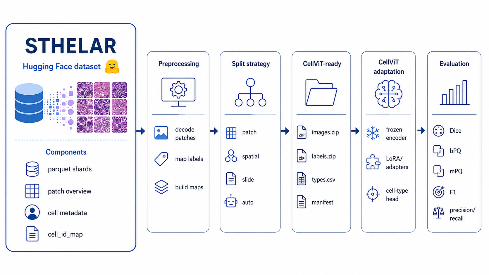

# Fine-Tuning the CellViT Model with STHELAR, a Xenium-Based Spatial Transcriptomics Dataset

<p align="center">
  
</p>

<p>
    <a href="https://doi.org/10.5281/zenodo.15849397"></a>
</p>

This repository is adapted from the original [CellViT repository](https://github.com/TIO-IKIM/CellViT) with the following reference:

> Horst, F. et al. *CellViT: Vision Transformers for precise cell segmentation and classification.* Medical Image Analysis 94, 103143 (2024). [doi: 10.1016/j.media.2024.103143](https://doi.org/10.1016/j.media.2024.103143)

All original information regarding the CellViT model, including its pre-training, architecture, and authorship, is maintained in [README_CellViT.md](README_CellViT.md).

This repository focuses on fine-tuning CellViT on **STHELAR**, a large-scale dataset linking histology and spatial transcriptomics. STHELAR was built using publicly available Spatial Transcriptomics data from the 10x Genomics Xenium platform. The dataset construction process, including H&E image patch extraction, nucleus segmentation, and cell-type annotation based on RNA information, is described in the [STHELAR GitHub repository](https://github.com/MICS-Lab/STHELAR).

STHELAR includes:

- H&E image patches;
- corresponding nucleus segmentation masks;
- cell-type annotations derived from RNA information;
- tissue provenance metadata;
- slide-level and patch-level information.

A detailed description of the pipeline, methods, and results can be found in:

> Giraud-Sauveur, F., Blampey, Q., Benkirane, H. et al. *STHELAR, a multi-tissue dataset linking spatial transcriptomics and histology for cell type annotation.* Scientific Data (2026). [doi:10.1038/s41597-026-06937-6](https://doi.org/10.1038/s41597-026-06937-6)

## Data Availability

The full STHELAR dataset is available through BioImage Archive:

-  Full dataset: [doi: 10.6019/S-BIAD2146](https://www.ebi.ac.uk/biostudies/bioimages/studies/S-BIAD2146)

A training-friendly subset is also available in Parquet format on Hugging Face:

-  STHELAR 40x: [doi: 10.57967/hf/6008](https://huggingface.co/datasets/FelicieGS/STHELAR_40x)
-  STHELAR 20x: [doi: 10.57967/hf/6009](https://huggingface.co/datasets/FelicieGS/STHELAR_20x)

The Hugging Face version contains Parquet shards with H&E patches, instance maps, patch metadata, and slide-level cell metadata. This repository includes preprocessing tools to convert those files into a CellViT-compatible dataset.

## Repository Goal

The goal of this repository is to fine-tune CellViT on STHELAR patches, using spatial-transcriptomics-derived cell type labels. In particular, this branch adds tools to:

- read the Hugging Face STHELAR Parquet dataset;
- decode H&E image patches;
- recover `cell_id_map` instance information;
- map `cell_id_int` to biological cell labels using slide-level metadata;
- build CellViT-compatible instance maps and nuclei type maps;
- create leakage-aware training, validation, and test splits;
- export the dataset in the ZIP-based format expected by the CellViT/PanNuke-style dataloader;
- run local and SLURM-based training experiments.

## Dataset Structure Expected by the Preprocessing Script

After downloading the Hugging Face dataset, the expected structure is approximately:

```text
STHELAR_20x/
├── patches_overview_sthelar20x.parquet
├── data/
│   ├── train-00000-of-00018.parquet
│   ├── train-00001-of-00018.parquet
│   └── ...
└── cell_metadata/
    ├── tonsil_s0_cell_metadata.parquet
    ├── tonsil_s1_cell_metadata.parquet
    └── ...

For STHELAR 40x, the structure is analogous, with patches_overview_sthelar40x.parquet.

Recommended local layout:

/Volumes/T9/Datasets/
├── STHELAR_20x/
├── STHELAR_40x/
└── cellvit_ready/

Recommended Ruche layout:

/gpfs/workdir/<username>/workspace/Datasets/
├── STHELAR_20x/
├── STHELAR_40x/
└── cellvit_ready/
```

Example download with the Hugging Face CLI:

```
hf download FelicieGS/STHELAR_20x \
  --repo-type dataset \
  --local-dir /Volumes/T9/Datasets/STHELAR_20x
```

On Ruche, the equivalent target path can be:

```
/gpfs/workdir/taddeial/workspace/Datasets/STHELAR_20x
```

## CellViT-Ready Output Format

The preprocessing script creates a dataset compatible with the CellViT/PanNuke-style dataloader:

```text
cellvit_ready/sthelar20x_tonsil_auto_500_bm64/
├── images.zip
├── labels.zip
├── types.csv
├── cell_count_train.csv
├── cell_count_valid.csv
├── cell_count_test.csv
├── dataset_config.yaml
├── patch_info_with_split.csv
└── split_manifest.yaml
```

The ZIP files contain the H&E images and label dictionaries. The CSV/YAML files store dataset statistics, split assignment, tissue metadata, and reproducibility information.

## Cell Type Labels

The current STHELAR-to-CellViT conversion uses five nuclei classes:

```
0 = Background
1 = Immune
2 = Stromal
3 = Epithelial
4 = Other
```

The label map is built by connecting the per-pixel cell_id_map to slide-level cell metadata through cell_id_int, then using the biological label stored in cells_final_label_group.

Note: The "Other" category in the article and the "Dead" category in parts of the original codebase refer to the same group of cells. In the manuscript, the neutral term "Other" is used consistently. The term "Dead" reflects an unverified hypothesis about cell state and may be incorrect for some cells.

## Splitting Strategies

This branch adds explicit control over the train/validation/test splitting strategy.

1. Patch-Level Split

A patch-level split randomly assigns patches to train, validation, and test sets. This is useful for quick debugging, but it can lead to overly optimistic results when nearby or overlapping patches from the same slide appear in different splits.

2. Spatial Split

A spatial split separates patches from the same slide according to their physical coordinates. For example, patches can be split along the x or y axis with a boundary margin to reduce spatial leakage.

Relevant parameters:

```
split_axis: "x"
boundary_margin: 64
train_frac_inside_train_slide: 0.85
valid_frac_inside_train_slide: 0.15
```

3. Slide-Level Split

A slide-level split assigns entire slides to different splits. This is stricter and better reflects generalization to unseen slides.

Example:

```
train: tonsil_s0
test:  tonsil_s1
```

4. Auto Strategy

The auto strategy chooses an appropriate strategy from the available slides. For example, with two selected tonsil slides, it can use:

```
train/valid: tonsil_s0, spatially split
test:        tonsil_s1, full slide
```

A typical resulting split is:

```
train: 466
valid: 33
test:  500
```

with the following interpretation:

```
tonsil_s0 -> train/valid spatial split
tonsil_s1 -> test
```

This is a reasonable compromise for debugging and early experiments: the test set is slide-level, while validation is created spatially inside the training slide because only two tonsil slides are available.

## Preprocessing Configuration Example

Example configuration:

```
sthelar_root: "/Volumes/T9/Datasets/STHELAR_20x"
output_root: "/Volumes/T9/Datasets/cellvit_ready/sthelar20x_tonsil_auto_500_bm64"

tissue: "tonsil"
tissue_name: "Tonsil"

strategy: "auto"
split_axis: "x"
boundary_margin: 64

train_frac: 0.70
valid_frac: 0.15
test_frac: 0.15

train_frac_inside_train_slide: 0.85
valid_frac_inside_train_slide: 0.15

max_patches_per_slide: 500
max_per_split: null

random_seed: 42
overwrite: true
keep_tmp: false
```

Suggested config paths:

- configs/preprocessing/sthelar20x_tonsil_auto_500_bm64_local.yaml
- configs/preprocessing/sthelar20x_tonsil_auto_500_bm64_ruche.yaml

## Running Preprocessing Locally

From the repository root:

```
cd /Users/alberto/Documents/Stage/Projects/CellViT_for_STHELAR
conda activate cellvit39_arm

python preprocessing/sthelar/convert_hf_to_cellvit.py \
  --config configs/preprocessing/sthelar20x_tonsil_auto_500_bm64_local.yaml
```

Expected output:

```
Created: /Volumes/T9/Datasets/cellvit_ready/sthelar20x_tonsil_auto_500_bm64/images.zip
Created: /Volumes/T9/Datasets/cellvit_ready/sthelar20x_tonsil_auto_500_bm64/labels.zip
Created: /Volumes/T9/Datasets/cellvit_ready/sthelar20x_tonsil_auto_500_bm64/types.csv
Created: /Volumes/T9/Datasets/cellvit_ready/sthelar20x_tonsil_auto_500_bm64/cell_count_train.csv
Created: /Volumes/T9/Datasets/cellvit_ready/sthelar20x_tonsil_auto_500_bm64/cell_count_valid.csv
Created: /Volumes/T9/Datasets/cellvit_ready/sthelar20x_tonsil_auto_500_bm64/cell_count_test.csv
Created: /Volumes/T9/Datasets/cellvit_ready/sthelar20x_tonsil_auto_500_bm64/dataset_config.yaml
Created: /Volumes/T9/Datasets/cellvit_ready/sthelar20x_tonsil_auto_500_bm64/patch_info_with_split.csv
Created: /Volumes/T9/Datasets/cellvit_ready/sthelar20x_tonsil_auto_500_bm64/split_manifest.yaml
```

## Running Preprocessing on Ruche

Example SLURM job:

```bash
#!/bin/bash
#SBATCH --job-name=prep_tonsil_500
#SBATCH --partition=gpu
#SBATCH --nodes=1
#SBATCH --ntasks=1
#SBATCH --cpus-per-task=8
#SBATCH --gres=gpu:1
#SBATCH --mem=32G
#SBATCH --time=02:00:00
#SBATCH --output=/gpfs/workdir/taddeial/workspace/CellViT_for_STHELAR/logs/%x_%j.out
#SBATCH --error=/gpfs/workdir/taddeial/workspace/CellViT_for_STHELAR/logs/%x_%j.err

set -euo pipefail

WORKSPACE=/gpfs/workdir/taddeial/workspace
REPO=$WORKSPACE/CellViT_for_STHELAR
CONFIG=$REPO/configs/preprocessing/sthelar20x_tonsil_auto_500_bm64_ruche.yaml

module purge
module load miniconda3/25.5.1/none-none
source activate cellvit39

mkdir -p $REPO/logs

cd $REPO

echo "===== PREPROCESSING JOB INFO ====="
echo "Hostname: $(hostname)"
echo "Date: $(date)"
echo "Working directory: $(pwd)"
echo "Git branch: $(git branch --show-current || echo unknown)"
echo "Git commit: $(git rev-parse --short HEAD || echo unknown)"
echo "CONFIG=$CONFIG"
which python
python -V
echo "=================================="

python preprocessing/sthelar/convert_hf_to_cellvit.py --config "$CONFIG"

echo "===== OUTPUT CHECK ====="
ls -lh /gpfs/workdir/taddeial/workspace/Datasets/cellvit_ready/sthelar20x_tonsil_auto_500_bm64
cat /gpfs/workdir/taddeial/workspace/Datasets/cellvit_ready/sthelar20x_tonsil_auto_500_bm64/split_manifest.yaml
echo "========================"
```

Submit with:

```
sbatch jobs/job_preprocess_sthelar20x_tonsil_auto_500_bm64.sh
squeue --me
```

## Training Configuration

Example training config path:

```
configs/training/train_sthelar20x_tonsil_auto_500_bm64_no_pretrained_e1_ruche.yaml
```

The dataset path should point to the CellViT-ready output:

```yaml
data:
  dataset: "PanNuke"
  dataset_path: "/gpfs/workdir/taddeial/workspace/Datasets/cellvit_ready/sthelar20x_tonsil_auto_500_bm64"
  train_folds: [0]
  val_folds: [1]
  test_folds: [2]
  num_nuclei_classes: 5
  num_tissue_classes: 1
  input_shape: 256
```

For local execution on Apple Silicon:

```yaml
gpu: "mps"
```

For Ruche/CUDA execution:

```yaml
gpu: 0
```

## Pretrained and Non-Pretrained Runs

The model architecture can be set to SAM-H:

```yaml
model:
  backbone: "SAM-H"
```

However, this does not automatically mean that pretrained weights are used. Pretraining is used only if the checkpoint files are present and explicitly loaded, for example:

```yaml
model:
  pretrained_encoder: "models/pretrained/sam_vit_h.pth"
  pretrained: "models/pretrained/CellViT-SAM-H-x40.pth"
```

If these files are not present, training with those paths will fail with a FileNotFoundError.

For a no-pretrained sanity check, use:

```yaml
model:
  backbone: "SAM-H"
  pretrained_encoder: null
  pretrained: null
```

or comment out those fields, depending on the parser behavior.

A no-pretrained run is useful to verify that preprocessing, dataloading, training, validation, and inference work correctly. For meaningful performance, pretrained CellViT/SAM weights should be used when available.

## Running Training Locally

Example:

```
cd /Users/alberto/Documents/Stage/Projects/CellViT_for_STHELAR
conda activate cellvit39_arm

python cell_segmentation/run_cellvit.py \
  --config configs/training/train_sthelar20x_tonsil_auto_500_bm64_no_pretrained_e1_local.yaml
```

For Apple Silicon, make sure the config contains:

```yaml
gpu: "mps"
```

## Running Training on Ruche

Example SLURM job:

```bash
#!/bin/bash
#SBATCH --job-name=cellvit_tonsil_500_e1
#SBATCH --partition=gpu
#SBATCH --nodes=1
#SBATCH --ntasks=1
#SBATCH --cpus-per-task=8
#SBATCH --gres=gpu:1
#SBATCH --mem=48G
#SBATCH --time=04:00:00
#SBATCH --output=/gpfs/workdir/taddeial/workspace/CellViT_for_STHELAR/logs/%x_%j.out
#SBATCH --error=/gpfs/workdir/taddeial/workspace/CellViT_for_STHELAR/logs/%x_%j.err

set -euo pipefail

WORKSPACE=/gpfs/workdir/taddeial/workspace
REPO=$WORKSPACE/CellViT_for_STHELAR
CONFIG=$REPO/configs/training/train_sthelar20x_tonsil_auto_500_bm64_no_pretrained_e1_ruche.yaml

module purge
module load miniconda3/25.5.1/none-none
source activate cellvit39

mkdir -p $REPO/logs
mkdir -p $REPO/run/sthelar20x_tonsil_auto_500_bm64_no_pretrained_e1_ruche/wandb
mkdir -p $REPO/run/sthelar20x_tonsil_auto_500_bm64_no_pretrained_e1_ruche/log

cd $REPO

echo "===== TRAINING JOB INFO ====="
echo "Hostname: $(hostname)"
echo "Date: $(date)"
echo "Working directory: $(pwd)"
echo "Git branch: $(git branch --show-current || echo unknown)"
echo "Git commit: $(git rev-parse --short HEAD || echo unknown)"
echo "CONFIG=$CONFIG"
echo "CUDA_VISIBLE_DEVICES=${CUDA_VISIBLE_DEVICES:-not_set}"
echo "SLURM_JOB_GPUS=${SLURM_JOB_GPUS:-not_set}"
echo "SLURM_STEP_GPUS=${SLURM_STEP_GPUS:-not_set}"
which python
python -V
nvidia-smi
echo "============================="

echo "===== PYTORCH CHECK ====="
python -c "import torch; \
print('torch =', torch.__version__); \
print('torch cuda =', torch.version.cuda); \
print('cuda available =', torch.cuda.is_available()); \
print('device count =', torch.cuda.device_count()); \
print('device =', torch.cuda.get_device_name(0) if torch.cuda.is_available() else 'NO CUDA')"
echo "========================="

echo "===== DATASET CHECK ====="
ls -lh /gpfs/workdir/taddeial/workspace/Datasets/cellvit_ready/sthelar20x_tonsil_auto_500_bm64
cat /gpfs/workdir/taddeial/workspace/Datasets/cellvit_ready/sthelar20x_tonsil_auto_500_bm64/split_manifest.yaml
echo "========================="

echo "===== PRETRAINED CHECK ====="
ls -lh models/pretrained/ || true
echo "============================"

python cell_segmentation/run_cellvit.py --config "$CONFIG" --gpu 0
```

Submit with:

```
sbatch jobs/job_train_sthelar20x_tonsil_auto_500_bm64_no_pretrained_e1.sh
squeue --me
```

Check logs with:

```
ls -lt logs | head
tail -f logs/cellvit_tonsil_500_e1_<JOBID>.out
```

## Batch Size and Validation Fix

Some CellViT code paths assume that tensors keep an explicit batch dimension. When a validation batch contains a single element, careless use of torch.squeeze can remove the batch dimension and produce a shape mismatch during one-hot encoding and permutation.

This branch modifies unpack_masks to handle both batched and single-sample tensors more robustly:

```python
nuclei_type_maps = masks["nuclei_type_map"].type(torch.int64)

if nuclei_type_maps.dim() == 4 and nuclei_type_maps.shape[1] == 1:
    nuclei_type_maps = nuclei_type_maps.squeeze(1)

if nuclei_type_maps.dim() == 2:
    nuclei_type_maps = nuclei_type_maps.unsqueeze(0)

gt_nuclei_type_maps_onehot = F.one_hot(
    nuclei_type_maps,
    num_classes=self.num_classes
).type(torch.float32)
```

This prevents errors of the form:

```
RuntimeError: permute(sparse_coo): number of dimensions in the tensor input does not match the length of the desired ordering of dimensions
```

The fix does not change the semantic content of the masks. It only preserves the expected tensor dimensions.

## Warnings on macOS

On macOS, the following message may appear during inference or dataloader multiprocessing:

```
MallocStackLogging: can't turn off malloc stack logging because it was not enabled.
```

This is usually a macOS multiprocessing/debugging warning and not a training error. It can generally be ignored if the run continues normally.

The warning:

```
pkg_resources is deprecated as an API
```

comes from dependencies such as torchmetrics and is also not directly related to the STHELAR preprocessing or CellViT training logic.

## Existing Codebase Modifications

Several modifications have been made to the original CellViT codebase, including:

- adapting the data format to efficiently handle large-scale STHELAR datasets;
- allowing flexible dataset selection by tissue, slide, and patch subset;
- supporting STHELAR Hugging Face Parquet input;
- converting STHELAR annotations into CellViT-compatible instance and type maps;
- adding split manifests for reproducibility;
- supporting slide-level and spatial validation strategies;
- improving robustness to single-sample validation batches;
- adding utilities to extract additional cell-level information and dataset statistics.

## Additional Scripts and Notebooks

The following files are included to support dataset preparation and analysis.

In cell_segmentation/datasets:

- convert_into_zip.py: Converts the dataset into ZIP format.
- make_folds_pannuke.py: Creates data splits based on slide selection and patch-level metrics. This code is provided to reproduce the CellViT fine-tuning illustrative experiments presented in the technical validation section. Patch-level splitting with overlap can lead to over-optimistic results; the metadata provided by STHELAR allows users to implement more robust validation strategies, such as slide-level splitting or spatial cross-validation.
- analyse_ds_patches.ipynb: Analyzes the composition and distribution of patches in the dataset.
- get_weights_dataset.ipynb: Computes weights for losses and dataset balancing.
- calculate_mean_std_train.py: Calculates the mean and standard deviation of RGB channels in the training set.
- calculate_loss_extrema.py and analyze_loss_extrema_training.ipynb: Estimate and analyze the range of loss values during training.
- macenko_normationzation(_v2).py: Performs Macenko normalization on the dataset.

In cell_segmentation/utils:

- HED_augmentation.py: H&E-specific data augmentation.

In preprocessing/sthelar:

- convert_hf_to_cellvit.py: Converts the Hugging Face STHELAR Parquet dataset into a CellViT-compatible ZIP dataset.

## Suggested Experiment Progression

A recommended workflow is:

1. Download STHELAR 20x or 40x from Hugging Face.
2. Run preprocessing on a small subset, for example 500 patches per slide.
3. Check the generated split_manifest.yaml.
4. Run a 1-epoch no-pretrained sanity check.
5. Verify that training, validation, checkpointing, and inference finish without crashing.
6. Add pretrained CellViT/SAM weights when available.
7. Run longer fine-tuning experiments.
8. Compare patch-level, spatial, and slide-level split strategies.
9. Extend to additional tissues, magnifications, and adaptation strategies.

## Example Current Sanity Check

A typical 20x tonsil sanity-check setup is:

- Dataset: STHELAR_20x
- Tissue: tonsil
- Slides: tonsil_s0, tonsil_s1
- Max patches per slide: 500
- Strategy: auto
- Actual split:
  - train: tonsil_s0 spatial subset
  - valid: tonsil_s0 spatial subset
  - test:  tonsil_s1 full slide
- Counts:
  - train: 466
  - valid: 33
  - test:  500

This setup is intended for debugging and pipeline validation, not for final scientific conclusions.

## Citation

If you use this repository, please cite both CellViT and STHELAR:

```bibtex
@article{hoerst2024cellvit,
  title={CellViT: Vision Transformers for precise cell segmentation and classification},
  author={Horst, Fabian and others},
  journal={Medical Image Analysis},
  volume={94},
  pages={103143},
  year={2024},
  doi={10.1016/j.media.2024.103143}
}
@article{giraudsauveur2026sthelar,
  title={STHELAR, a multi-tissue dataset linking spatial transcriptomics and histology for cell type annotation},
  author={Giraud-Sauveur, F. and Blampey, Q. and Benkirane, H. and others},
  journal={Scientific Data},
  year={2026},
  doi={10.1038/s41597-026-06937-6}
}
```
