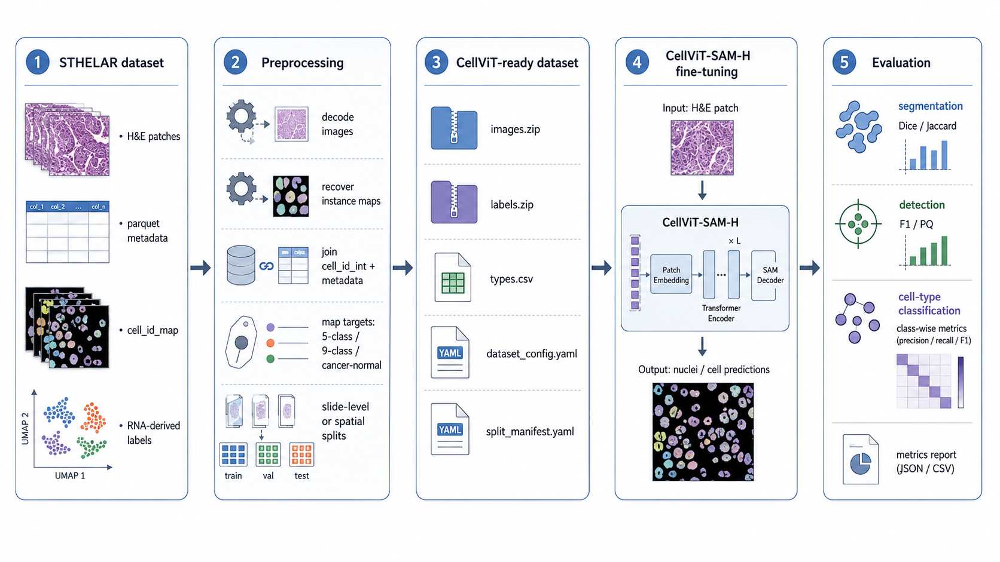

# CellViT for STHELAR

<p align="center">
  
</p>

This repository adapts [CellViT](https://github.com/TIO-IKIM/CellViT) for fine-tuning on **STHELAR**, a Xenium-based spatial transcriptomics dataset linking H&E histology patches, nucleus instance maps, and RNA-derived cell-type annotations.

The original CellViT implementation and documentation are preserved in [README_CellViT.md](README_CellViT.md).

## Overview

The goal of this repository is to convert STHELAR Hugging Face Parquet data into a CellViT-compatible format and fine-tune CellViT for nucleus segmentation and cell-type classification.

The repository provides tools to:

- read STHELAR Hugging Face Parquet shards;
- decode H&E image patches and `cell_id_map` instance maps;
- join `cell_id_int` with slide-level cell metadata;
- generate CellViT/PanNuke-style `images.zip`, `labels.zip`, and metadata files;
- define 5-class, 9-class, or cancer/normal label spaces;
- create patch-level, spatial, or slide-level train/validation/test splits;
- run local training or SLURM-based training on HPC clusters.

## References

This repository is based on CellViT:

> Horst, F. et al. *CellViT: Vision Transformers for precise cell segmentation and classification.* Medical Image Analysis 94, 103143 (2024).
> DOI: [10.1016/j.media.2024.103143](https://doi.org/10.1016/j.media.2024.103143)

It uses STHELAR:

> Giraud-Sauveur, F., Blampey, Q., Benkirane, H. et al. *STHELAR, a multi-tissue dataset linking spatial transcriptomics and histology for cell type annotation.* Scientific Data (2026).
> DOI: [10.1038/s41597-026-06937-6](https://doi.org/10.1038/s41597-026-06937-6)

## Data

STHELAR is available from:

- BioImage Archive full dataset: [S-BIAD2146](https://www.ebi.ac.uk/biostudies/bioimages/studies/S-BIAD2146)
- Hugging Face 40x subset: [FelicieGS/STHELAR_40x](https://huggingface.co/datasets/FelicieGS/STHELAR_40x)
- Hugging Face 20x subset: [FelicieGS/STHELAR_20x](https://huggingface.co/datasets/FelicieGS/STHELAR_20x)

This repository currently targets the Hugging Face Parquet version.

Expected input structure:

```text
STHELAR_20x/
├── patches_overview_sthelar20x.parquet
├── data/
│   ├── train-00000-of-00018.parquet
│   └── ...
└── cell_metadata/
    ├── tonsil_s0_cell_metadata.parquet
    └── ...

The 40x dataset follows the same structure, with patches_overview_sthelar40x.parquet.
```

## Installation

Clone the repository:

```
git clone <repository-url>
cd CellViT_for_STHELAR
```

Create and activate a Python environment. For example:

```
conda create -n cellvit_sthelar python=3.9
conda activate cellvit_sthelar
```

Install dependencies:

```
pip install -r requirements.txt
```

The exact environment may depend on the target machine, especially for PyTorch/CUDA or Apple Silicon/MPS.

## Configuration Files

The main editable configuration files are:

```text
configs/
├── preprocessing_sthelar.yaml
├── training_sthelar.yaml
└── examples/
    ├── preprocessing_sthelar20x_5class.yaml
    ├── preprocessing_sthelar20x_9class.yaml
    ├── preprocessing_sthelar20x_cancer_normal.yaml
    ├── training_sthelar20x_5class.yaml
    ├── training_sthelar20x_9class.yaml
    └── training_sthelar20x_cancer_normal.yaml
```

Use configs/preprocessing_sthelar.yaml and configs/training_sthelar.yaml as the active configuration files.

The files in configs/examples/ provide ready-to-adapt examples for common STHELAR settings.

## Preprocessing

Edit:

```
configs/preprocessing_sthelar.yaml
```

Set at least:

```
sthelar_root: /path/to/STHELAR_20x
output_root: /path/to/cellvit_ready/sthelar20x_dataset
```

Then run:

```
python preprocessing/sthelar/convert_hf_to_cellvit.py \
  --config configs/preprocessing_sthelar.yaml
```

The converter creates:

```text
output_root/
├── images.zip
├── labels.zip
├── types.csv
├── cell_count_train.csv
├── cell_count_valid.csv
├── cell_count_test.csv
├── dataset_config.yaml
├── patch_info_with_split.csv
└── split_manifest.yaml
```

## Label Spaces

The converter supports flexible label mappings through YAML configuration.

Common settings include:

5-class grouped labels

```
0 = Background
1 = Immune
2 = Stromal
3 = Epithelial
4 = Other
```

9-class STHELAR labels

```
0 = Background
1 = Epithelial
2 = Blood_vessel
3 = Fibroblast_Myofibroblast
4 = Myeloid
5 = B_Plasma
6 = T_NK
7 = Melanocyte
8 = Specialized
9 = Other
```

Cancer/Normal labels

```
0 = Background
1 = Cancer
2 = Normal
```

The cancer/normal setting uses the cells_label3 metadata column and can exclude low-information less10 cells from both detection and type supervision.

## Splitting Strategies

The preprocessing script supports:

- baseline: random patch-level split;
- spatial: coordinate-based split inside each slide;
- slide: slide-level split;
- auto: slide-level split when multiple slides are available, spatial split otherwise.

The generated split_manifest.yaml records the actual split strategy, selected slides, split counts, and reproducibility metadata.

## Training

Edit:

```
configs/training_sthelar.yaml
```

Set:

```yaml
data:
  dataset_path: /path/to/cellvit_ready/sthelar20x_dataset
  num_nuclei_classes: 5
```

Then run:

```
python cell_segmentation/run_cellvit.py \
  --config configs/training_sthelar.yaml
```

For CUDA machines, use:

```yaml
gpu: 0
```

For Apple Silicon, use:

```yaml
gpu: "mps"
```

The model checkpoint can be configured with:

```yaml
model:
  pretrained: models/pretrained/CellViT-SAM-H-x20.pth
```

Set it to null for a no-pretrained sanity check.

## SLURM / Ruche Usage

SLURM scripts are provided in:

```text
ruche/
├── slurm_preprocess.sh
└── slurm_train.sh
```

Basic usage:

```
sbatch ruche/slurm_preprocess.sh configs/preprocessing_sthelar.yaml
sbatch ruche/slurm_train.sh configs/training_sthelar.yaml
```

## Utility Scripts

Inspect raw STHELAR data

```
python preprocessing/sthelar/inspect_dataset.py \
  --sthelar-root /path/to/STHELAR_20x \
  --magnification 20 \
  --slide-id tonsil_s0 \
  --row-index 0 \
  --mode 5class
```

Visualize a converted patch

```
python preprocessing/sthelar/visualize_patch.py \
  --dataset-root /path/to/cellvit_ready/sthelar20x_dataset \
  --split train \
  --index 0
```

## Repository Structure

```text
CellViT_for_STHELAR/
├── configs/
│   ├── preprocessing_sthelar.yaml
│   ├── training_sthelar.yaml
│   └── examples/
├── preprocessing/
│   └── sthelar/
│       ├── convert_hf_to_cellvit.py
│       ├── inspect_dataset.py
│       └── visualize_patch.py
├── ruche/
│   ├── slurm_preprocess.sh
│   └── slurm_train.sh
├── cell_segmentation/
├── models/
├── docs/
└── README_CellViT.md
```

## Citation

If you use this repository, please cite both CellViT and STHELAR:

```bibtex
@article{hoerst2024cellvit,
  title={CellViT: Vision Transformers for precise cell segmentation and classification},
  author={Horst, Fabian and others},
  journal={Medical Image Analysis},
  volume={94},
  pages={103143},
  year={2024},
  doi={10.1016/j.media.2024.103143}
}

@article{giraudsauveur2026sthelar,
  title={STHELAR, a multi-tissue dataset linking spatial transcriptomics and histology for cell type annotation},
  author={Giraud-Sauveur, F. and Blampey, Q. and Benkirane, H. and others},
  journal={Scientific Data},
  year={2026},
  doi={10.1038/s41597-026-06937-6}
}
```
